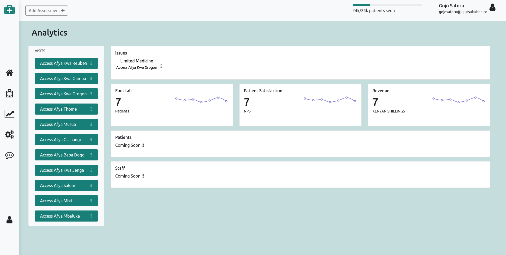

# Access Afya Technical Assessment Test Dashboard

> This is an analytics dashboard for the measurement and optimization of key metrics that are fundamental for operational efficiency of the healthcare clinics spread country-wide.



The project uses Apollo Server + MongoDB for the Backend GraphQL API & ReactJS + Apollo Client for the Frontend.

## Built With
### Backend
- <b>NodeJS</b> : As an asynchronous event-driven JavaScript runtime [https://nodejs.org/en/about/ ](https://nodejs.org/en/about/)
- <b>TypeScript</b> : A strict syntatical superset of Javascript and adds optional static typing of the language.[https://www.typescriptlang.org/ ](https://www.typescriptlang.org/)
- <b>Apollo Server</b> : An open-source GraphQL server [https://www.apollographql.com/docs/apollo-server/] (https://www.apollographql.com/docs/apollo-server/)
- <b>graphql</b> : A query language for APIs & a runtime for fulfilling the queries with existing data [https://graphql.org/] (https://graphql.org/)
- <b>mongoDB</b> : A document object database [https://www.mongodb.com/ ](https://www.mongodb.com/)
- <b>mongoose</b> : An Object Data Modeling (ODM) library for MongoDB and Node. js that makes it easy to do mongoDB operations [https://mongoosejs.com/](https://mongoosejs.com/) 
- <b>mongoose-unique-validator</b> : A plugin that adds pre-save validation for unique fiels within a mongoose schema [https://www.npmjs.com/package/mongoose-unique-validator] (https://www.npmjs.com/package/mongoose-unique-validator)
- <b>jsonwebtoken</b> : A library that allows one to create Json Web Tokens. [https://www.npmjs.com/package/jsonwebtoken ](https://www.npmjs.com/package/jsonwebtoken )
- <b>bcrypt</b> : A library for hashing passwords [https://www.npmjs.com/package/bcrypt] (https://www.npmjs.com/package/bcrypt)
- <b>dotenv</b> : A package that loads environment variables from a .env file into process.env. [https://www.npmjs.com/package/dotenv](https://www.npmjs.com/package/dotenv)
- <b>tslog</b> : Expressive logging for NodeJS [https://www.npmjs.com/package/tslog] (https://www.npmjs.com/package/tslog)
- <b>eslint</b> : A static code analysis tool for identifying problematic patterns in javascript code. [https://eslint.org/] (https://eslint.org/)
- <b>ts-node-dev</b> : TypeScript execution and REPL for node.js, with source map support. [https://www.npmjs.com/package/ts-node] (https://www.npmjs.com/package/ts-node)

#### Folder structure
```
 
└───Controllers
│   └───ExampleController.ts
|    
└───models
|   └───ExampleModel.ts
|
└───Mutations
|   └───ExampleMutation.ts
|
└───queries
|   └───ExampleQuery.ts
|
└───resolvers
|   └───index.ts
|   └───ExampleResolver.ts
|
└───schemas
│   └───index.ts
│   └───ExampleSchema.ts
|
└───graphql.ts
|
└───app.ts
└───index.ts
```
  
### Frontend
- <b>ReactJS (Create React App)</b> : Allows one to Create React apps with no build configuration. [https://create-react-app.dev/](https://create-react-app.dev/)
- <b>Javascript</b> : Programming language mostly used for building web pages.
- <b>Bootstrap</b> : A free and open-source CSS framework directed at responsive, mobile-first front-end web development [https://getbootstrap.com/](https://getbootstrap.com/)
- <b>font-awesome</b> : a font and icon toolkit based on CSS and Less [https://fontawesome.com/](https://fontawesome.com/)
- <b>PopperJS</b> : A tooltip & popover positioning engine. [https://popper.js.org/] (https://popper.js.org/)
- <b>node-sass</b> : It allows you to natively compile .scss files to css at incredible speed and automatically via a connect middleware. [https://www.npmjs.com/package/node-sass] (https://www.npmjs.com/package/node-sassr)
- <b>recharts</b> : A composable charting library built on React components, [https://recharts.org/en-US/] (https://recharts.org/en-US/)
- <b>Axios</b>: Promise based HTTP client for the browser and node.js [https://www.npmjs.com/package/axios](https://www.npmjs.com/package/axios)
- <b>Apollo Client</b> : A comprehensive state management library for JavaScript that enables you to manage both local and remote data with GraphQL. [https://www.apollographql.com/docs/react/] (https://www.apollographql.com/docs/react/)
- <b>React Hook Form</b> : A form validation library. [https://react-hook-form.com/] (https://react-hook-form.com/)
- <b>yup</b> :  javascript schema builder for value parsin and validation. [https://www.npmjs.com/package/yup] (https://www.npmjs.com/package/yup)

#### Folder structure
```
src 
└───Components
│   └───Example
│       │   Example.js
│       │   Example.scss
│   └───Example2
│       │   Example2.js
│       │   Example2.scss
|
└───graphql
|   └───mutations
│   │   |───index.js
|   |
|   └───queries
│       │───index.js
|
|
|
└───Pages
│   └───Example
│       │   
│       └───Example.js
│       │   
│       └───Example.scss
|
```

## Live Demo

[DASHBOARD](https://access-afya-analytics.herokuapp.com/)<br/>
[GRAPHQL API](https://aata-backend.herokuapp.com/)


## Getting Started

To get a local copy up and running follow these simple example steps.

### Prerequisites
    - NodeJS required
### Setup
- Clone the Repository
- Go to https://www.mongodb.com/cloud/atlas
- Create  new cluster
<br/><a href="https://www.mongodb.com/cloud/atlas" target="_blank"></a>
<br/>

- Choose AWS provider and any free-tier data center
<br/>
<br/><a href="https://www.mongodb.com/cloud/atlas" target="_blank"></a>
<br/>  

- use the database access tab for creating user credentials for the database. 
Please note that these are not the same credentials you use for logging into MongoDB Atlas. 
These will be used for your application to connect to the database.
<br/>
<br/><a href="https://www.mongodb.com/cloud/atlas" target="_blank"></a>
<br/>

- grant the user with permissions to read and write to the databases.
<br/>
<br/><a href="https://www.mongodb.com/cloud/atlas" target="_blank"></a>    
<br/>

- Define the IP addresses that are allowed access to the database.
<br/><a href="https://www.mongodb.com/cloud/atlas" target="_blank"></a> 
<br/>

- For the sake of simplicity we will allow access from all IP addresses: 
<br/>
<br/><a href="https://www.mongodb.com/cloud/atlas" target="_blank"></a> 
<br/>

- Finally we are ready to connect to our database. Start by clicking connect:
<br/>
<br/><a href="https://www.mongodb.com/cloud/atlas" target="_blank"></a> 
<br/>

- Choose ```  Connect your application:``` 
<br/>
<br/><a href="https://www.mongodb.com/cloud/atlas" target="_blank"></a> 
<br/>The view displays the MongoDB URI, which is the address of the database that we will supply to the MongoDB client library we will add to our application.
<br/><a href="https://www.mongodb.com/cloud/atlas" target="_blank"></a> 
<br/>The address looks like this:
```mongodb+srv://<USERNAME>:<PASSWORD>@cluster0-ostce.mongodb.net/<DB-NAME><DB_NAME>?retryWrites=true```

- Copy the Address
- Create a .env file in the root of your the backend folder.
- Use the following syntax to save mongoDB URI as shown in env.example
    ``` 
    MONGODB_URI=MONGODB_URL
    PORT=3001
    SECRET=SECRET_NUMBER
    JWT_SECRET=SECRET_STRING

    ```
- Replace ``` MONGODB_URL ``` with the address you got from mongoDB cloud atlas
- Replace ``` SECRET_NUMBER ``` with an integer eg *10* . This will be used when generating a JWT token

### Install
- Navigate to the backend folder ```cd  backend```
- Run ``` npm install``` . This will install all the dependencies needed for the project
- Navigate to the frontend folder ```cd frontend```
- Run ```npm install``` . This will install all the
dependencies needed for the project
### Usage
- Navigate to the backend folder ```cd  backend```
- Run ``` npm run dev``` . This will initialize the 
backend
- Navigate to the frontend folder ```cd frontend```
- Run ```npm start``` . This will initialize the
frontend

### Known bugs
 - The database transactions (especially create patient) need to be optimized 

## commit headers
- [FEATURE] - New Feature
- [ENHANCEMENT] - Improvement of an existing feature
- [FIX] - bug fixes of existing features

## Support and contact details
Contact me on brianwachira7@gmail.com for any comments, reviews or advice.

### License

This project is licensed under the terms of the **MIT** license.

>You can check out the full license [here](https://github.com/brianwachira/aata/blob/main/LICENSE.md)  

Copyright (c) **Brian Wachira**

